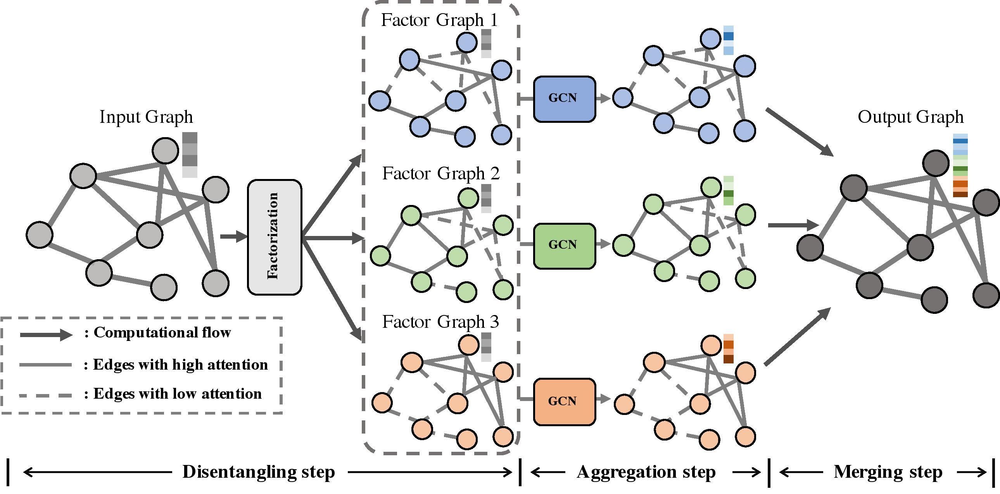

# PyTorch implementation of FactorGCN

Paper: [Factorizable Graph Convolutional Networks](https://arxiv.org/pdf/2010.05421.pdf), NeurIPS'20

## Method Overview



## Dependencies

See [requirment](requirment.txt) file for more information
about how to install the dependencies.

## Usage

### 1, Prerequisites

### Datasets

We provide [here](https://drive.google.com/drive/folders/1a5i3_S-22wFjp5NIL9WxoMvaUwUE0NLQ?usp=sharing) 
datasets that are ready to use
within this project.
Download the datasets and unzip it into
**./data** dir.
These datasets can also be either 
downloaded from their official websites 
or generated on the fly.

### Models

We use [DGL](https://www.dgl.ai/) to 
implement all the GCN models. 
In order to evaluate the disentanglement performance of GAT model, 
you need to modify the last line of 

> dgl/nn/pytorch/conv/gatconv.py

from
`return rst`
to
`return rst, graph.local_var(), graph.edata['a']`

### 2, Training

The `train_*.sh` scripts contains the training codes for corresponding datasets and methods. 

> **train_synth.sh** for Synthetic dataset;

> **train_zinc.sh** for ZINC dataset;

> **train_gin.sh** for IMDB-B, COLLAB, and MUTAG datasets.

> **train_pattern.sh** for pattern datasets.

The model as well as the training log
will be saved to the corresponding dir in **./data** for evaluation.

### 3, Evaluation

The **evaluation** dir contains the codes and examples for evaluating the performance of
both the task-related performance and the disentanglement performance.

> **generate_report.get_acc_report** reports the accuracy on the 
Synthetic dataset;

> **generate_report.get_mae_report** reports the MAE on the ZINC dataset;

> **generate_report.get_10fold_curve_report** report the 10-fold cross-validation performance on IMDB-B, COLLAB, and MUTAG datasets.

The performances of disentanglement are evaluated
as  and C-score.

> **ged_eval_synth** generates the disentanglement performance
on the Synthetic dataset;

> **ged_eval_zinc** generates the disentanglement performance
on the ZINC dataset.

## Cite

```
@article{yang2020factorizable,
  title={Factorizable Graph Convolutional Networks},
  author={Yang, Yiding and Feng, Zunlei and Song, Mingli and Wang, Xinchao},
  journal={Advances in Neural Information Processing Systems},
  volume={33},
  year={2020}
}
```

## License

FactorGCN is released under the MIT license. Please see the [LICENSE](LICENSE) file for more information.
